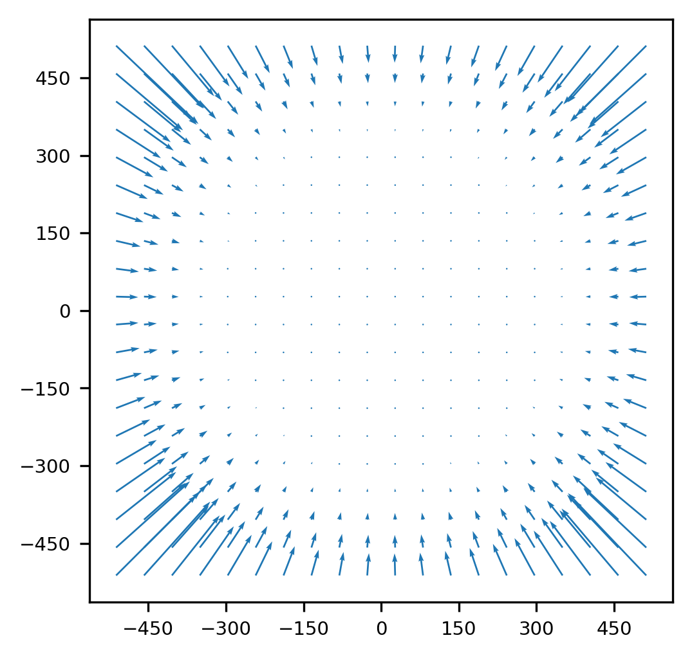
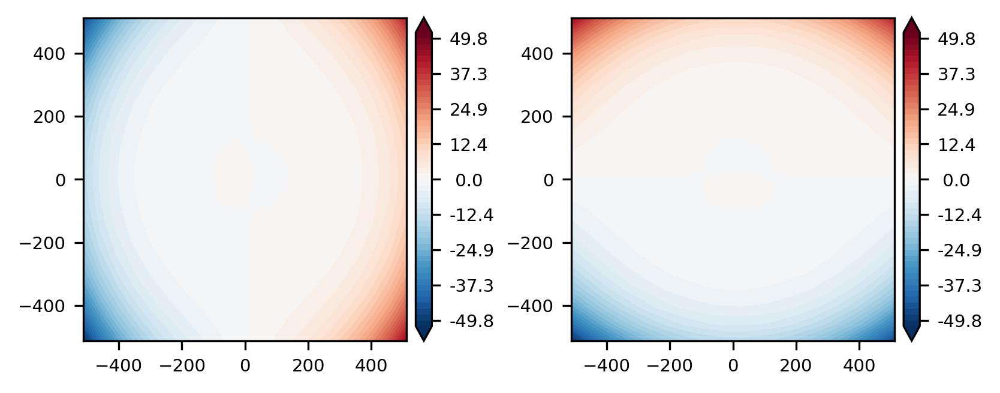
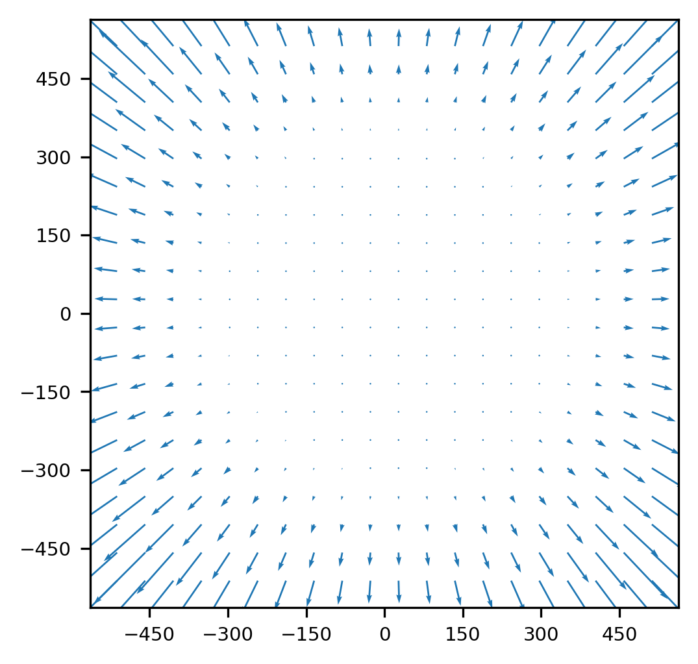
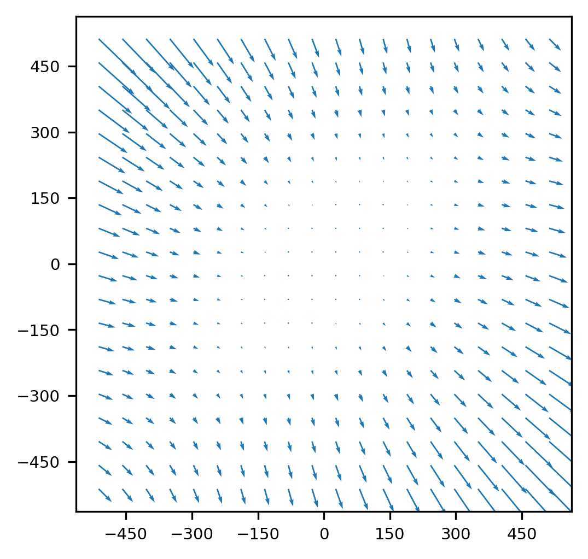
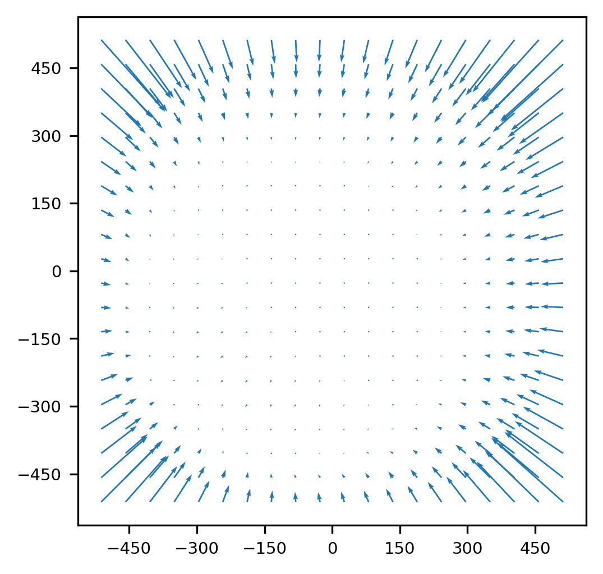
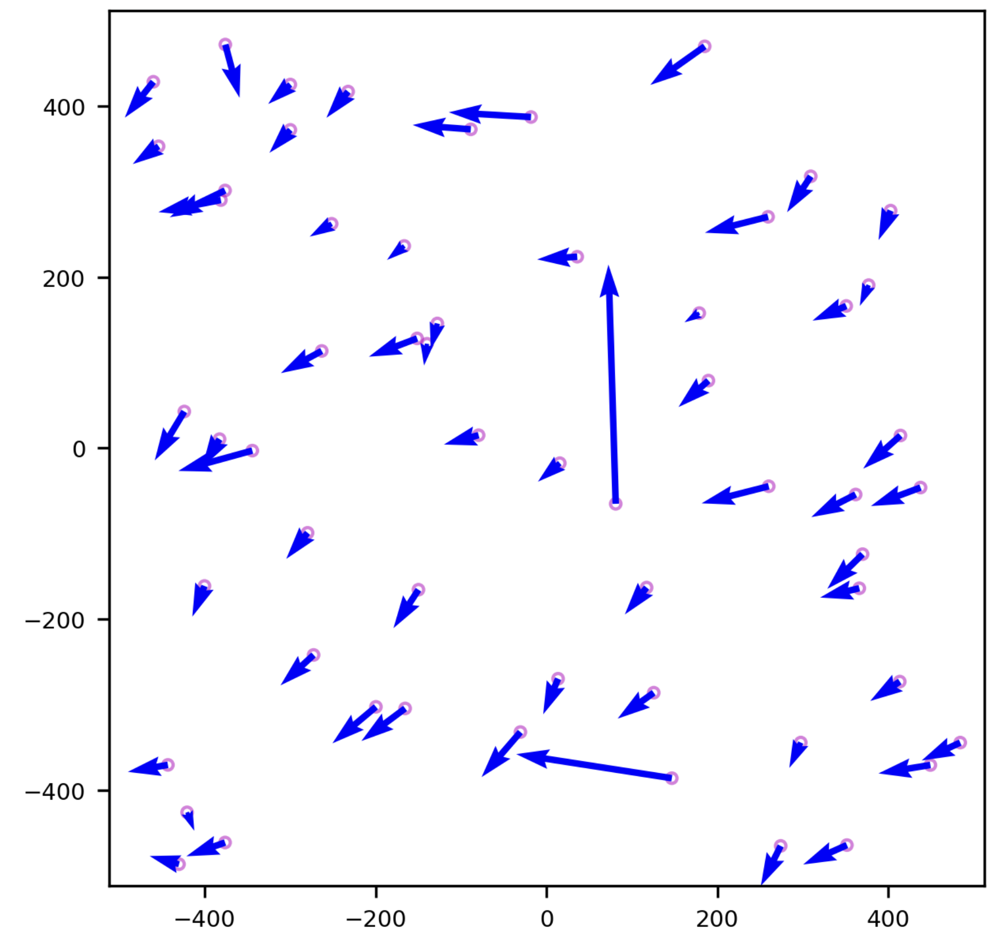
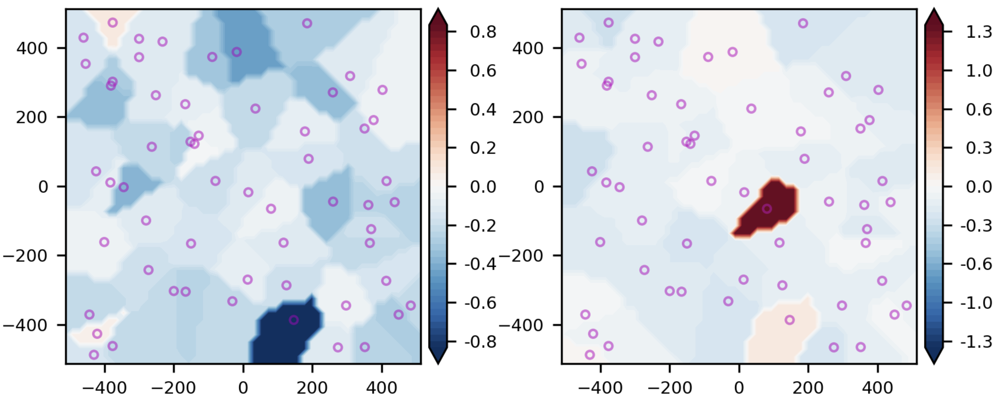

# Welcome to the STARMATCH package

[](https://pypi.python.org/pypi/starmatch/) [](https://pypi.python.org/pypi/starmatch/) [](https://pypi.python.org/pypi/starmatch/) [](https://GitHub.com/lcx366/STARMATCH/graphs/contributors/) [](https://GitHub.com/lcx366/STARMATCH/graphs/commit-activity) [](https://github.com/lcx366/STARMATCH/blob/master/LICENSE) [](http://starmatch.readthedocs.io/?badge=latest) [](https://travis-ci.org/lcx366/starmatch)

This package is an archive of scientific routines for star map matching, camera center pointing calibration, and distortion correction, and astronomical positioning. Currently, key features of the package include:

1. Construct geometric distortion model/distortion-correction model for camera, and sketch the vector plot of distortion. Currently, supported distortion models include:
- Standard Radial Distortion Model(SRDM)
- Division-mode Radial Distortion Model(DRDM)
- Tangential Distortion Model(TDM)
- Brown–Conrady Distortion Model(BCDM)
2. Calculate the distortion at any pixel on the image based on the distortion model/distortion-correction model;
3. Estimate the approximate center pointing of the camera by blind matching over star maps;
4. Star Map Matching;
5. Calibrate the orientation of the camera center;
6. Astronomical Positioning and Apparent Magnitude Estimation.

## How to Install

On Linux, macOS and Windows architectures, the binary wheels can be installed using pip by executing one of the following commands:

```
pip install starmatch
pip install starmatch --upgrade # to upgrade a pre-existing installation
```

## How to use

-----------------------------

### Geometric Distortion Model

Available distortion models include Standard Radial Distortion Model(SRDM), Division-mode Radial Distortion Model(DRDM), Tangential Distortion Model(also known as the de-centering distortion), and Brown-Conrady Distortion Model(BCDM).

Considering that the distortion model involves the power of the distance from the distortion center to pixels, the length scale is introduced here. Associaated with the length scale, the normalized model coefficients is also necessary.

#### Example: Standard Radial Distortion Model(SRDM)

The Standard Radial Distortion Model(SRDM) is defined by the distortion center and the distortion coefficients.

- The 3rd order polynomial in standard form: $r_u = r_d + k_1  r_d^3$
- The 5th order polynomial in standard form: $r_u = r_d + k_1  r_d^3 + k_2  r_d^5$
- The 5th order polynomial in all form: $r_u = r_d + k_1  r_d^2 + k_2  r_d^3 + k_3  r_d^4 + k_4  r_d^5$,
  where $r_d$ is the distance between the distorted pixel coordinates and the distortion center, $r_u$ is the distance between the distortion-corrected pixel coordinates and the distortion center.
1. The 3rd order polynomial in standard form only works well for small amounts of distortion.
2. The 5th order polynomial produce more accurate results, especially for “wave” or “mustache” distortion, which might resemble barrel near the center of the image and pincushion near the corners (or vice-versa).
3. The 5th order all form use all coefficients up to the maximum instead of alternate coefficients (odd or even-only). We have not observed much advantage to these settings.
4. Higher order polynomials (7th order or higher) should be used with great care because results can become unstable, especially at the outer parts of the image. The image used to calculate the coefficients should have valid corner points near the edge of the image and there should be sufficient rows or columns. 

Basic formulas are as follows:

$x_u - x_c = r_u  \cos(\theta) = r_u  (x_d - x_c)/r_d = ... $

$y_u - y_c = r_u  \sin(\theta) = r_u  (y_d - y_c)/r_d = ... $

where $(x_c,y_c)$ is the pixel coordinates of the distortion center.

For more details, please refer to 

1. [Distortion_(optics)](https://en.wikipedia.org/wiki/Distortion_(optics))
2. [imatest distortion-methods](https://www.imatest.com/docs/distortion-methods-and-modules/)
3. [imatest distortion-models](https://www.imatest.com/support/docs/pre-5-2/geometric-calibration-deprecated/distortion-models/) 

##### Construct a Standard Radial Distortion Model

```python
>>> from starmatch.classes import Distortion
>>> model = 'RadialStandard' # Type of distortion model
>>> coeffs = [-1e-4,1e-4] # Coefficients of 5th order SRDM in form of [k1,k2]
>>> dc = [0.1,0.1] # Pixel coordinates of the distortion center
>>> distortion_scale = 128 # The length scale of the distortion model, that is, the number of pixels per unit length
>>> distortion = Distortion(model,coeffs,dc,distortion_scale) # Establish a distortion model
```

##### Compute the distortion-corrected pixel coordinates

```python
>>> pixels_xy = [367,125]
>>> pixels_XY = distortion.apply(pixels_xy)
>>> print(pixels_XY)
>>> # [[369.21610677 125.70199655]]
>>> #Calculate the distortion-corrected pixel coordinates at normalized scale
>>> #pixels_xy = [[2.8671875, 0.9765625], [1.109375, -0.875]]
>>> #pixel_scale = 128
>>> #pixels_XY  = distortion.apply(pixels_xy,pixel_scale)
>>> #print(pixels_XY)
```

##### Sketch the distortion

Vector plot of the distortion:

```python
>>> xlim,ylim = 512,512
>>> distortion.sketchmap(xlim,ylim)
>>> #For normalized pixel coordinates
>>> #xlim,ylim = 4,4
>>> #pixel_scale = 128
>>> #distortion.sketchmap(xlim,ylim,pixel_scale)
```

<p align="middle">
  
</p>

Contour plot of the distortion in x and y components respectively:

```python
>>> distortion.sketchmap(xlim,ylim,mode='contourf')
```

<p align="middle">
  
</p>

#### Example: Division-mode Radial Distortion Model(DRDM)

The Division-mode Radial Distortion Model defined by the distortion center and the distortion coefficients.

- The 2nd order polynomial in division form: $r_u = r_d /(1+ k_1  r_d^2)$
- The 4th order polynomial in division form: $r_u = r_d /(1+ k_1  r_d^2 + k_2  r_d^4)$

Basic formulas for DRDM are same as that for SRDM.

##### Construct a Division-mode Radial Distortion Model

```python
>>> from starmatch.classes import Distortion
>>> model = 'RadialDivision' # Type of distortion model
>>> coeffs = [-1e-4,1e-4] # Coefficients of 4th order DRDM in form of [k1,k2]
>>> dc = [0.1,0.1] # Pixel coordinates of the distortion center
>>> distortion_scale = 128 # The length scale of the distortion model, that is, the number of pixels per unit length
>>> distortion = Distortion(model,coeffs,dc,distortion_scale) # Establish a distortion model
```

##### Compute the distortion-corrected pixel coordinates

```python
>>> pixels_xy = [367,125]
>>> pixels_XY = distortion.apply(pixels_xy)
>>> print(pixels_XY)
>>> # [[364.79767243 124.30236829]]
>>> #Calculate the distortion-corrected pixel coordinates at normalized scale
>>> #pixels_xy = [[2.8671875, 0.9765625], [1.109375, -0.875]]
>>> #pixel_scale = 128
>>> #pixels_XY  = distortion.apply(pixels_xy,pixel_scale)
>>> #print(pixels_XY)
```

##### Sketch the vector plot of distortion

```python
>>> xlim,ylim = 512,512
>>> distortion.sketchmap(xlim,ylim)
>>> #For normalized pixel coordinates
>>> #xlim,ylim = 4,4
>>> #pixel_scale = 128
>>> #distortion.sketchmap(xlim,ylim,pixel_scale)
```

<p align="middle">
  
</p>

#### Example: Tangential Distortion Model(TDM)

The Tangential Distortion Model(also known as the de-centering distortion) is defined by the distortion center and the distortion coefficients.

Basic formulas are as follows:

$x_u = x_d + (P_1  (r_d^2 + 2 (x_d - x_c)^2) + 2 P_2  (x_d-x_c) (y_d-y_c)) (1 + P_3  r_d^2 + P_4  r_d^4 + ...)$

$y_u = y_d + (P_2  (r_d^2 + 2 (y_d - y_c)^2) + 2 P_1  (x_d-x_c) (y_d-y_c)) (1 + P_3  r_d^2 + P_4  r_d^4 + ...)$

##### Construct a Tangential Distortion Model

```python
>>> from starmatch.classes import Distortion
>>> model = 'Tangential' # Type of distortion model
>>> coeffs = [-1e-4,1e-4] # Coefficients of 2nd order SRDM in form of [P1,P2]
>>> dc = [0.1,0.1] # Pixel coordinates of the distortion center
>>> distortion_scale = 128 # The length scale of the distortion model, that is, the number of pixels per unit length
>>> distortion = Distortion(model,coeffs,dc,distortion_scale) # Establish a distortion model
```

##### Compute the distortion-corrected pixel coordinates

```python
>>> pixels_xy = [367,125]
>>> pixels_XY = distortion.apply(pixels_xy)
>>> print(pixels_XY)
>>> # [[366.75821931 125.06542319]]
>>> #Calculate the distortion-corrected pixel coordinates at normalized scale
>>> #pixels_xy = [[2.8671875, 0.9765625], [1.109375, -0.875]]
>>> #pixel_scale = 128
>>> #pixels_XY  = distortion.apply(pixels_xy,pixel_scale)
>>> #print(pixels_XY)
```

##### Sketch the vector plot of distortion

```python
>>> xlim,ylim = 512,512
>>> distortion.sketchmap(xlim,ylim)
>>> #For normalized pixel coordinates
>>> #xlim,ylim = 4,4
>>> #pixel_scale = 128
>>> #distortion.sketchmap(xlim,ylim,pixel_scale)
```

<p align="middle">
  
</p>

#### Example: Brown–Conrady Distortion Model(BCDM)

The Brown–Conrady model corrects both the radial distortion and the tangential distortion caused by physical elements in a lens not being perfectly aligned.

Basic formulas are as follows:

$x_u = x_d + (x_d - x_c)  (K_1  r_d^2 + K_2  r_d^4 + ...) + (P_1  (r_d^2 + 2  (x_d-x_c)^2) + 2  P_2  (x_d-x_c)  (y_d-y_c))  (1 + P_3  r_d^2 + P_4  r_d^4 + ...)$

$y_u = y_d + (y_d - x_c)  (K_1  r_d^2 + K_2  r_d^4 + ...) + (P_2  (r_d^2 + 2  (y_d-y_c)^2) + 2  P_1  (x_d-x_c)  (y_d-y_c))  (1 + P_3  r_d^2 + P_4  r_d^4 + ...)$

##### Construct a Brown–Conrady Distortion Model

```python
>>> from starmatch.classes import Distortion
>>> model = 'Brown–Conrady' # Type of distortion model
>>> coeffs = [[-1e-4,1e-4],[1e-3,1e-3,1e-4,1e-5]] # Coefficients of Brown–Conrady distortion model in form of [[coeffs_radial],[coeffs_tangential]]
>>> dc = [0.1,0.1] # Pixel coordinates of the distortion center
>>> distortion_scale = 128 # The length scale of the distortion model, that is, the number of pixels per unit length
>>> distortion = Distortion(model,coeffs,dc,distortion_scale) # Establish a distortion model
```

### Compute the distortion-corrected pixel coordinates

```python
>>> pixels_xy = [367,125]
>>> pixels_XY = distortion.apply(pixels_xy)
>>> print(pixels_XY)
>>> # [[372.88150908 127.60108593]]
>>> #Calculate the distortion-corrected pixel coordinates at normalized scale
>>> #pixels_xy = [[2.8671875, 0.9765625], [1.109375, -0.875]]
>>> #pixel_scale = 128
>>> #pixels_XY  = distortion.apply(pixels_xy,pixel_scale)
>>> #print(pixels_XY)
```

##### Sketch the vector plot of distortion

```python
>>> xlim,ylim = 512,512
>>> distortion.sketchmap(xlim,ylim)
>>> #For normalized pixel coordinates
>>> #xlim,ylim = 4,4
>>> #pixel_scale = 128
>>> #distortion.sketchmap(xlim,ylim,pixel_scale)
```

<p align="middle">
  
</p>

---------------------------------

### Star Map matching for Astromonical Images

Ahead of star map matching, a set of star catalog index files should be genarated using the python package starcatalogquery, which can be installed by `pip install starcatalogquery`. For more details, please refer to [STARQUERY](https://github.com/lcx366/STARQUERY).

1. **Load the simplified star catalog**

```python
>>> from starcatalogquery import StarCatalog
>>> # The following star catalog directory stores tile files with a size of 3.66 degrees, containing stars brighter than magnitude 12.0, with proper motion corrections applied to the epoch 2019.5.
>>> dir_from_simplified = 'starcatalogs/simplified/at-hyg24/mag12.0/epoch2019.5/'
>>> sc_simplified = StarCatalog.load(dir_from_simplified)
```

2. **Extract sources from images or files**

The python package `starextractor` can be used to implement the source extraction, which can be installed by `pip install starextractor`. For more details, please refer to [STAREXTRACTOR](https://github.com/lcx366/STAREXTRACTOR). For the sake of simplicity, here is a test file *test.txt* provided, which contains the pixel coordinates of the point sources in the image (with the origin located in the upper left corner of the image) and the grayscale values after deducting the background. **Note: The pixel coordinates have been arranged in descending order according to the brightness of the point source. If the pixel coordinates are not sorted, it is necessary to perform a sorting operation, unless it can be guaranteed that these point sources are the brightest dozens of stars in the captured image.**

```python
>>> import numpy as np
>>> data = np.loadtxt('obs/test.txt')
>>> # Translate the origin of coordinates to the center of the image and normalize the coordinates of the point sources.
>>> x = data[:, 0] - 512 # The resolution is (1024,1024)
>>> y = 512 - data[:, 1]
>>> xy = np.stack((x, y), axis=1)
>>> flux = data[:, 2]
```

3. **Load the data of sources and camera parameters into StarMatch**

```python
>>> from starmatch import StarMatch
>>> # Configure the FOV[deg], pixel width[deg], and resolutions
>>> camera_params = {'fov':(2,2),'pixel_width':0.002,'res':(1024,1024)} # {'res':(1024,1024)} for blind matching
>>> # The top 30 brightest point sources are used to calculate the geometric invariants.
>>> max_control_points=30
>>> # Two methods for calculating geometric invariants are provided:
>>> # 2-component 'triangles' generated by three stars and 4-component 'quads' generated by four stars.
>>> mode_invariants = 'triangles'
>>> sources = StarMatch.from_sources(xy,camera_params,flux_raw=flux,max_control_points=30,mode_invariants=mode_invariants) # No distortion correction is applied
```

4. **Estimate the center pointing of the camera**

**If the approximate orientation of the camera is known, this step can be skipped.**

```python
>>> k_min, k_max = 1,6 # Set the minimum and maximum HEALPix hierarchy level.
>>> sc_simplified.h5_hashes(k_min, k_max, mode_invariants) # Establish a hashed file of geometric invariant in hdf5 format for the star catalog
>>> sc_simplified.read_h5_hashes() # Read the star catalog hashed file
>>> # Blind matching with multi-core parallel computing
>>> fp_radec,pixel_width_estimate,fov_estimate = sources.center_pointing(sc_simplified)
>>> print(fp_radec,pixel_width_estimate,fov_estimate) 
```

5. **Star Map matching for Astronomical Images**

```python
>>> fp_radec = [141.8,-2] # Approximate orientation of the camera in form of [Ra,Dec] in degrees.
>>> astrometry_corrections = {'t':'2019-02-26T20:11:14.347','proper-motion':None,'aberration':(0.55952273, -1.17780654,  7.50324956),'parallax':None}
>>> sources.align(fp_radec,sc_simplified,astrometry_corrections=astrometry_corrections,distortion_calibrate='gpr')
>>> print(sources)
>>> # Affined results, where a small number of sources are used for initiating star map matching.
>>> print(sources.affined_results)
>>> # Matched results, where a large number of sources are used for enhancing star map matching
>>> print(sources.matched_results)
>>> # Calibrated results, where distortion is corrected based on the matched_results
>>> print(sources.calibrated_results)
```

About the astrometry corrections on star catalogs:

astrometry_corrections -> [dict] Dictionary specifying the types of corrections to apply.

- 't' -> [str] Observation time in UTC, such as '2019-02-26T20:11:14.347'.
   It specifies the time at which corrections are to be applied.
- 'proper-motion' -> [None] If present, apply proper motion correction.
   This term corrects for the motion of stars across the sky due to their velocities.
- 'aberration' -> [tuple] Aberration correction parameters. Observer's velocity relative to Earth's center (vx, vy, vz) in km/s.
   This term corrects for the apparent shift in star positions due to the motion of the observer.
- 'parallax' -> [None] If present, apply parallax correction.
   This term corrects for the apparent shift in star positions due to the change in observer's viewpoint as the Earth orbits the Sun.
- 'deflection' -> [None] If present, apply light deflection correction.
   This term corrects for the bending of light from stars due to the gravitational field of the Sun, based on general relativity.

About the distortion estimation and calibration:

- 'gpr': Nonparametric Gaussian Process Regression(GPR).

- 'piecewise-affine': The transform is based on a Delaunay triangulation of the points to form a mesh. Each triangle is used to find a local affine transform.

- 'polynomial': 2D polynomial transformation with the following form
  
  $$
  X = \sum_{j=0}^2\sum_{i=0}^j a_{ji} x^{j - i} y^i \\
Y = \sum_{j=0}^2\sum_{i=0}^j b_{ji} x^{j - i} y^i   
  $$

About the `affine_results`/ `matched_results`/ `calibrated_results`:

These results refer to the statistic information of the Star Map matching, and record the following attributes:

- xy: Computed pixel coordinates of sources.  
- xy_res: Residuals of pixel coordinates.  
- xy_rms: RMS of of pixel coordinates.  
- mag_res: Residuals of magnitudes of sources.  
- mag_rms: RMS of magnitudes.  
- C: Magnitudes constant.  
- C_sigma: Uncertainty of magnitudes constant.  
- catalog_df: DataFrame of matched stars.  
- _description: Results description.  
- pixels_camera_match: Pixel coordinates of sources.  
- radec_res: Residuals of celestial coordinates.  
- radec_rms: RMS of celestial coordinates.
6. **Calibrate the orientation of the camera center**

```python
>>> sources.fp_calibrate()
>>> print(sources.fp_radec_calibrated)
```

7. **Show distortion map**

The vector plot shows the distortion(displacement) where the sources are located.

```python
>>> sources.show_distortion('vector')
```

<p align="middle">
  
</p>

The contour plot shows the distortion in the x and y directions, respectively.

```python
>>> sources.show_distortion('contourf')
```

<p align="middle">
  
</p>

### Astrometric Positioning and Magnitude Estimation

Estimate celestial coordinates and apparent magnitudes of targets.

```python
>>> # Also normalize the coordinates of the targets as done for stars.
>>> x_target,y_target = 125.717 - 512,512 - 397.795
>>> xy_target = [x_target,y_target]
>>> flux_target = 3003.62
>>> radec,mag_affine,mag_match = sources.apply(xy_target,flux_target)
```

**Lastly, the estimated target celestial coordinates above represent the apparent position, not the true position. By applying corrections for aberration and light-time effect, the apparent position can be adjusted to the true position. This is especially important when the relative velocity between the observer and the space target is significant, as the deviation between the apparent direction and the true direction can reach several arcseconds. A straightforward approach is to apply a light-time (τ) offset to the observation time, with the target's apparent direction at the current time t being the same as its true direction at time t−τ.**

----------------------------------

### Show matching stars on image

```python
>>> from starextractor import parse_image
>>> image_file = 'obs/fits/img_00000.fits' #image_file = 'obs/bmp/img_00000.bmp'
>>> image_data = parse_image(image_file)
>>> sources = image_data.find_source()
>>> camera_params = {'fov':(8,8),'pixel_width':0.01,'res':(1024,1024)}
>>> sources = StarMatch.from_sources(sources.xy,camera_params,flux_raw=sources.brightness)
>>> fp_radec = [201,31]
>>> sources.align(fp_radec,sc_simplified)
>>> sources.show_starmatch(image_data.image_raw,image_data._offset)
```

<p align="middle">
  
</p>

Stars marked in the image are consistent with the `catalog_df`.

```python
print(sources.matched_results.catalog_df)
```

<p align="middle">
  
</p>

## Change log

- **0.2.1 — Jul 09, 2024**
  
  - Added two methods for outliers recognition in star map mismatching ahead of distortion calibration:
    - 'lowess': Identifies outliers with the method of LOWESS (Locally Weighted Scatterplot Smoothing). LOWESS uses a weighted **linear regression** by default.
    - 'iqr': Identifies outliers with the method of Interquartile Range (IQR).

- **0.2.0 — Jul 07, 2024**
  
  - Compatible with astronomical corrections, including proper motion, annual parallax, aberration, and light deflection.
  - Added two distortion estimation methods:
    - 'piecewise-affine': The transform is based on a Delaunay triangulation of the points to form a mesh. Each triangle is used to find a local affine transform.
    - 'polynomial': 2D polynomial transformation.
  - Implemented a star map blind matching algorithm for astronomical images, which can adapt to the field of view of images from tens of degrees to tens of arc minutes.

- **0.1.4 — Sep 23, 2023**
  
  - Fixed an issue where star chart matching failed after performing a blind match.

- **0.1.3 — Sep 05, 2023**
  
  - Added contour plot for distortion models.
  - Minor bugs fixed.

- **0.1.2 — Jul 23, 2023**
  
  - Simplified the use of blind matching.
  - Added pixel width and field of view estimates for blind matching.

- **0.1.1 — Jun 16, 2023**
  
  - The ***starmatch*** package was released.

## Next release

- Find the inverse transformation of distortion models  
- Eliminate outliers in GPR

## Reference

- [Distortion_(optics)](https://en.wikipedia.org/wiki/Distortion_(optics))
- [imatest distortion-methods](https://www.imatest.com/docs/distortion-methods-and-modules/)
- [imatest distortion-models](https://www.imatest.com/support/docs/pre-5-2/geometric-calibration-deprecated/distortion-models/) 
- [Astroalign](https://astroalign.quatrope.org/en/latest/index.html)
