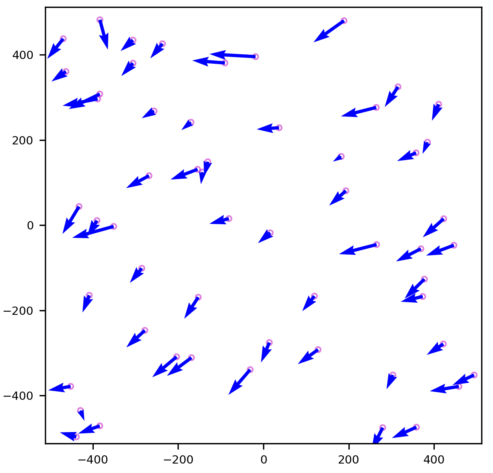

# Welcome to the STARMATCH package

[](https://pypi.python.org/pypi/starmatch/) [](https://pypi.python.org/pypi/starmatch/) [](https://pypi.python.org/pypi/starmatch/) [](https://GitHub.com/lcx366/STARMATCH/graphs/contributors/) [](https://GitHub.com/lcx366/STARMATCH/graphs/commit-activity) [](https://github.com/lcx366/STARMATCH/blob/master/LICENSE) [](http://starmatch.readthedocs.io/?badge=latest) [](https://travis-ci.org/lcx366/starmatch)

**STARMATCH** is a Python package for **star map matching**, **astronomical positioning**, and **relative photometry**. It provides tools for identifying star patterns, aligning observed fields with reference catalogs, and measuring relative brightness across frames.

## 🚀 Key Features

**1. Star Map Matching**

- Automatically match star maps and estimate the **initial camera pointing direction** without prior information about the camera’s orientation or FOV.

- Calibrate and fine-tune the **camera center pointing** for precise alignment when an approximate pointing direction is available.

**2. Astronomical Positioning**

- Derive precise **celestial coordinates (RA, Dec)** for spatial objects using calibrated camera orientation.

**3. Apparent Magnitude Estimation**

- Estimate **apparent magnitudes** of spatial objects if brightness is given.

**4. Distortion Correction**

- Build **camera distortion-correction models** to simulate lens distortions. Supported distortion models include:
  
  - **Standard Radial Distortion Model (SRDM)**
  
  - **Division-mode Radial Distortion Model (DRDM)**
  
  - **Tangential Distortion Model (TDM)**
  
  - **Brown–Conrady Distortion Model (BCDM)**

- Apply distortion-correction methods to ensure accurate astronomical positioning. Supported methods include:
  
  - 2D polynomial fitting based on distortion models.
  
  - Gaussian Process Regression.
  
  - Piecewise-Affine: The transform is based on a Delaunay triangulation of the points to form a mesh. Each triangle is used to find a local affine transform.

## 🛠️ How to Install

To install STARMATCH, simply use `pip` in your terminal:

```
pip install starmatch
pip install starmatch --upgrade # to upgrade a pre-existing installation
```

## 📚 How to Use

### Star Map matching for Astronomical Images

To perform star map matching using the **STARMATCH** package, you must first prepare a set of **star catalog tile files** and the corresponding **index file**. This preparation is handled by the companion package [**STARQUERY**](https://github.com/lcx366/STARQUERY), which can be installed via:

```bash
pip install starcatalogquery
```

STARMATCH relies on the data outputs generated by STARQUERY, including:

- A **simplified star catalog** stored in partitioned **Parquet** tile files.

- An **index file** for efficient spatial querying.

- Optional **HDF5-format hash files** for blind star map matching using geometric invariants (e.g., triangles or quads).

Refer to the [STARQUERY ](https://github.com/lcx366/STARQUERY/tree/main)documentation for full processing workflows.

**Step 1: Load the Simplified Star Catalog**

```python
>>> from starcatalogquery import StarCatalog
>>> base_dir = os.path.expanduser("~/src/sc-data")
>>> dir_from_simplified = os.path.join(base_dir,'starcatalogs/simplified/at-hyg32/lvl6-mag12.0/epoch2019.5/')  # Path to the simplified star catalog
>>> sc_simplified = StarCatalog.load(dir_sc_simplified)
```

**Step 2: Extract Sources from Images or Files**

To extract star-like sources from an astronomical image, you can use the dedicated Python package [**STAREXTRACTOR**](https://github.com/lcx366/STAREXTRACTOR):

```bash
pip install starextractor
```

For example, a test file (test.txt) containing pixel coordinates and grayscale values of extracted sources is as follows:

```python
>>> import numpy as np
>>> data = np.loadtxt('obs/test.txt')
>>> # Translate the origin of coordinates to the center of the image
>>> x = data[:, 0] - 512 # The resolution is (1024,1024)
>>> y = 512 - data[:, 1]
>>> xy = np.stack((x, y), axis=1)
>>> flux = data[:, 2]
```

💡 **Note**: Ensure the pixel coordinates are sorted by grayscale (flux) in **descending order**. This is critical for prioritizing the brightest stars during pattern matching.

**Step 3: Load Sources and Camera Parameters**

```python
>>> from starmatch import StarMatch
>>> # Configure camera parameters: FOV[deg], pixel width[deg], and resolution
>>> camera_params = {'fov':(2,2),'pixel_width':0.002,'res':(1024,1024)} # The resolution is mandatory
>>> mode_invariants = 'quads' # Options: 'triangles' or 'quads'
>>> sources = StarMatch.from_sources(xy,camera_params,flux_raw=flux,mode_invariants=mode_invariants) # No distortion correction is applied
>>> sc_simplified.check_lvl(camera_params) # Check consistency between the camera-derived HEALPix level and the star catalog level.
```

**Step 4: Estimate the Camera’s Center Pointing**

**This step is optional if the approximate pointing is known.**

To enable fast blind star pattern recognition, STARQUERY pre-divides the celestial sphere into **hierarchical HEALPix levels**, ranging from **K1** to **K10**. 

At each level:

- A fixed number of the **brightest stars** (e.g., top 5 per tile) are selected.

- These stars are **aggregated upward** into the **K1 level**.

- For each K1 pixel, **geometric invariants** (triangles or quads) are computed and stored in **precompiled HDF5 hash files** (.h5).

```python
>>> sc_hashed = sc_simplified.hashes() # Build the h5-formatted Hash File
```

The hash file contains the following components:

- 🔭 **Center Pointing**
  
  Right Ascension and Declination of the central point of the K1 pixel.

- 📐 **Pixel Coordinates**
  
  2D projected positions (e.g., via TAN projection) of the brightest stars.

- 🧩 **Geometric Invariants**
  
  Precomputed invariant features for triangle or quad asterisms.

- ✳️ **Asterism Indices**
  
  The star index tuples (e.g., [i, j, k] or [i, j, k, l]) defining each triangle or quad.

```python
>>> # Estimate the initial camera pointing
>>> fp_radec,pixel_width_estimate,fov_estimate = sources.center_pointing(sc_hashed)
```

**Step 5: Star Map Matching with Known Pointing**

If the camera orientation is approximately known, use the **Triangles** matching method.

```python
>>> fp_radec = [141.8,-2] # Approximate pointing [Ra,Dec] in degrees
>>> astrometry_corrections = {
    't': '2019-02-26T20:11:14.347',
    'proper-motion': None,
    'aberration': (0.5595, -1.1778, 7.5032),
    'parallax': None
    }
>>> # Perform alignment with distortion correction
>>> sources.align(fp_radec,sc_simplified,astrometry_corrections=astrometry_corrections,distortion_calibrate='gpr')
>>> print(sources)

>>> # Display results
>>> print(sources.affined_results)
>>> print(sources.matched_results)
>>> print(sources.calibrated_results)
```

**About Distortion Calibration:**

- 'gpr': Nonparametric Gaussian Process Regression(GPR).

- 'piecewise-affine': The transform is based on a Delaunay triangulation of the points to form a mesh. Each triangle is used to find a local affine transform.

- 'polynomial': 2D polynomial transformation with the following form
  
  $X = \sum_{j=0}^2 \sum_{i=0}^j a_{ji} x^{j - i} y^i$
  
  $Y = \sum_{j=0}^2 \sum_{i=0}^j b_{ji} x^{j - i} y^i$

**Explanation of Results:**

- `affined_results`: Initial alignment results.

- `matched_results`: Enhanced results using more sources.

- `calibrated_results`: Final results after applying distortion correction.

Each result includes:

- xy: Computed pixel coordinates of sources.  

- xy_res: Residuals of pixel coordinates.  

- xy_rms: RMS of of pixel coordinates.  

- mag_res: Residuals of magnitudes of sources.  

- mag_rms: RMS of magnitudes.  

- C: Magnitudes constant.  

- C_sigma: Uncertainty of magnitudes constant.  

- catalog_df: DataFrame of matched stars.  

- _description: Results description.  

- pixels_camera_match: Pixel coordinates of sources.  

- radec_res: Residuals of celestial coordinates.  

- radec_rms: RMS of celestial coordinates.

**Step 6: Calibrate the Camera’s Orientation**

```python
>>> sources.fp_calibrate()
>>> print(sources.fp_radec_calibrated)
```

**Step 7: Visualize the Distortion Map**

Generate a vector plot showing the distortion at various points:

```python
>>> sources.show_distortion('vector')
```

<p align="middle">
  
</p>

To visualize the distortion in the x and y directions using a contour plot:

```python
>>> sources.show_distortion('contourf')
```

<p align="middle">
  
</p>

### Astrometric Positioning and Magnitude Estimation

Estimate celestial coordinates and apparent magnitudes of spatial objects.

```python
>>> # Ensure the coordinates origin of targets are translated to the center of the image as done for stars
>>> x_target,y_target = 125.717 - 512,512 - 397.795
>>> xy_target = [x_target,y_target]
>>> flux_target = 3003.62
>>> radec,mag_affine,mag_match = sources.apply(xy_target,flux_target)
```

**💡 Note**: The celestial coordinates estimated above represent the apparent position, not the true position. When the relative velocity between the observer and the space target is significant, corrections for **aberration** and **light-time effects** are essential. The apparent direction at time t corresponds to the true direction at time t−τ (where τ is the light-time offset). Applying this correction helps account for deviations that can reach several arcseconds.

### Visualize Matched Stars on the Image

To display matched stars directly on the original astronomical image:

```python
>>> from starextractor import parse_image

>>> # Load the image (supports FITS or BMP formats)
>>> image_file = 'obs/fits/img_00000.fits'  # or 'obs/bmp/img_00000.bmp'
>>> image_data = parse_image(image_file)

>>> # Extract sources from the image
>>> sources = image_data.find_source()

>>> # Configure camera parameters
>>> camera_params = {'fov': (8, 8), 'pixel_width': 0.01, 'res': (1024, 1024)}
>>> sources = StarMatch.from_sources(sources.xy, camera_params, flux_raw=sources.brightness)
>>> sc_simplified.check_lvl(camera_params)

>>> # Perform star map alignment using a known approximate orientation
>>> fp_radec = [201, 31]  # Example pointing direction [RA, Dec] in degrees
>>> sources.align(fp_radec, sc_simplified)

>>> # Display matched stars on the image
>>> sources.show_starmatch(image_data.image_raw, image_data._offset)
```

<p align="middle">
  
</p>

The stars marked in the image should align with entries in `catalog_df`:

```python
print(sources.matched_results.catalog_df)
```

<p align="middle">
  
</p>

### Troubleshooting on Star Map Matching

If star map matching fails, consider the following:

1. **Image Coordinates**: Ensure that the origin of the image coordinates is correctly set. The origin may differ (e.g., upper-left corner vs. lower-left corner). Adjust the pixel coordinates of the sources accordingly.

2. **Field of View**: Select an appropriate star catalog based on the field of view:
   
   - **Bright star catalog**: Suitable for a large field of view.
   
   - **Faint star catalog**: Suitable for a smaller field of view.

3. **Geometric Invariants**: When constructing geometric invariants, the default number of stars used in the **kd-Tree nearest neighbor search** is 9. Increasing this number may **improve the success rate of matching**.

4. **Blind Matching**: For small fields of view, consider increasing the **HEALPix level** to enhance the success rate of blind matching.

### Geometric Distortion Model

Available distortion models include Standard Radial Distortion Model(SRDM), Division-mode Radial Distortion Model(DRDM), Tangential Distortion Model(also known as the de-centering distortion), and Brown-Conrady Distortion Model(BCDM).

Considering that the distortion model involves the power of the distance from the distortion center to pixels, the length scale is introduced here. Associaated with the length scale, the normalized model coefficients is also necessary.

#### Example: Standard Radial Distortion Model(SRDM)

The Standard Radial Distortion Model(SRDM) is defined by the distortion center and the distortion coefficients.

- The 3rd order polynomial in standard form: $r_u = r_d + k_1  r_d^3$
- The 5th order polynomial in standard form: $r_u = r_d + k_1  r_d^3 + k_2  r_d^5$
- The 5th order polynomial in all form: $r_u = r_d + k_1  r_d^2 + k_2  r_d^3 + k_3  r_d^4 + k_4  r_d^5$,
  where $r_d$ is the distance between the distorted pixel coordinates and the distortion center, $r_u$ is the distance between the distortion-corrected pixel coordinates and the distortion center.
1. The 3rd order polynomial in standard form only works well for small amounts of distortion.
2. The 5th order polynomial produce more accurate results, especially for “wave” or “mustache” distortion, which might resemble barrel near the center of the image and pincushion near the corners (or vice-versa).
3. The 5th order all form use all coefficients up to the maximum instead of alternate coefficients (odd or even-only). We have not observed much advantage to these settings.
4. Higher order polynomials (7th order or higher) should be used with great care because results can become unstable, especially at the outer parts of the image. The image used to calculate the coefficients should have valid corner points near the edge of the image and there should be sufficient rows or columns. 

Basic formulas are as follows:

$x_u - x_c = r_u  \cos(\theta) = r_u  (x_d - x_c)/r_d = ... $

$y_u - y_c = r_u  \sin(\theta) = r_u  (y_d - y_c)/r_d = ... $

where $(x_c,y_c)$ is the pixel coordinates of the distortion center.

For more details, please refer to 

1. [Distortion_(optics)](https://en.wikipedia.org/wiki/Distortion_(optics))
2. [imatest distortion-methods](https://www.imatest.com/docs/distortion-methods-and-modules/)
3. [imatest distortion-models](https://www.imatest.com/support/docs/pre-5-2/geometric-calibration-deprecated/distortion-models/) 

##### Construct a Standard Radial Distortion Model

```python
>>> from starmatch.classes import Distortion
>>> model = 'RadialStandard' # Type of distortion model
>>> coeffs = [-1e-4,1e-4] # Coefficients of 5th order SRDM in form of [k1,k2]
>>> dc = [0.1,0.1] # Pixel coordinates of the distortion center
>>> distortion_scale = 128 # The length scale of the distortion model, that is, the number of pixels per unit length
>>> distortion = Distortion(model,coeffs,dc,distortion_scale) # Establish a distortion model
```

##### Compute the distortion-corrected pixel coordinates

```python
>>> pixels_xy = [367,125]
>>> pixels_XY = distortion.apply(pixels_xy)
>>> print(pixels_XY)
>>> # [[369.21610677 125.70199655]]
>>> #Calculate the distortion-corrected pixel coordinates at normalized scale
>>> #pixels_xy = [[2.8671875, 0.9765625], [1.109375, -0.875]]
>>> #pixel_scale = 128
>>> #pixels_XY  = distortion.apply(pixels_xy,pixel_scale)
>>> #print(pixels_XY)
```

##### Sketch the distortion

Vector plot of the distortion:

```python
>>> xlim,ylim = 512,512
>>> distortion.sketchmap(xlim,ylim)
>>> #For normalized pixel coordinates
>>> #xlim,ylim = 4,4
>>> #pixel_scale = 128
>>> #distortion.sketchmap(xlim,ylim,pixel_scale)
```

<p align="middle">
  
</p>

Contour plot of the distortion in x and y components respectively:

```python
>>> distortion.sketchmap(xlim,ylim,mode='contourf')
```

<p align="middle">
  
</p>

#### Example: Division-mode Radial Distortion Model(DRDM)

The Division-mode Radial Distortion Model defined by the distortion center and the distortion coefficients.

- The 2nd order  in division form: $r_u = r_d /(1+ k_1  r_d^2)$
- The 4th order  in division form: $r_u = r_d /(1+ k_1  r_d^2 + k_2  r_d^4)$

Basic formulas for DRDM are same as that for SRDM.

##### Construct a Division-mode Radial Distortion Model

```python
>>> from starmatch.classes import Distortion
>>> model = 'RadialDivision' # Type of distortion model
>>> coeffs = [-1e-4,1e-4] # Coefficients of 4th order DRDM in form of [k1,k2]
>>> dc = [0.1,0.1] # Pixel coordinates of the distortion center
>>> distortion_scale = 128 # The length scale of the distortion model, that is, the number of pixels per unit length
>>> distortion = Distortion(model,coeffs,dc,distortion_scale) # Establish a distortion model
```

##### Compute the distortion-corrected pixel coordinates

```python
>>> pixels_xy = [367,125]
>>> pixels_XY = distortion.apply(pixels_xy)
>>> print(pixels_XY)
>>> # [[364.79767243 124.30236829]]
>>> #Calculate the distortion-corrected pixel coordinates at normalized scale
>>> #pixels_xy = [[2.8671875, 0.9765625], [1.109375, -0.875]]
>>> #pixel_scale = 128
>>> #pixels_XY  = distortion.apply(pixels_xy,pixel_scale)
>>> #print(pixels_XY)
```

##### Sketch the vector plot of distortion

```python
>>> xlim,ylim = 512,512
>>> distortion.sketchmap(xlim,ylim)
>>> #For normalized pixel coordinates
>>> #xlim,ylim = 4,4
>>> #pixel_scale = 128
>>> #distortion.sketchmap(xlim,ylim,pixel_scale)
```

<p align="middle">
  
</p>

#### Example: Tangential Distortion Model(TDM)

The Tangential Distortion Model(also known as the de-centering distortion) is defined by the distortion center and the distortion coefficients.

Basic formulas are as follows:

$x_u = x_d + (P_1  (r_d^2 + 2 (x_d - x_c)^2) + 2 P_2  (x_d-x_c) (y_d-y_c)) (1 + P_3  r_d^2 + P_4  r_d^4 + ...)$

$y_u = y_d + (P_2  (r_d^2 + 2 (y_d - y_c)^2) + 2 P_1  (x_d-x_c) (y_d-y_c)) (1 + P_3  r_d^2 + P_4  r_d^4 + ...)$

##### Construct a Tangential Distortion Model

```python
>>> from starmatch.classes import Distortion
>>> model = 'Tangential' # Type of distortion model
>>> coeffs = [-1e-4,1e-4] # Coefficients of 2nd order SRDM in form of [P1,P2]
>>> dc = [0.1,0.1] # Pixel coordinates of the distortion center
>>> distortion_scale = 128 # The length scale of the distortion model, that is, the number of pixels per unit length
>>> distortion = Distortion(model,coeffs,dc,distortion_scale) # Establish a distortion model
```

##### Compute the distortion-corrected pixel coordinates

```python
>>> pixels_xy = [367,125]
>>> pixels_XY = distortion.apply(pixels_xy)
>>> print(pixels_XY)
>>> # [[366.75821931 125.06542319]]
>>> #Calculate the distortion-corrected pixel coordinates at normalized scale
>>> #pixels_xy = [[2.8671875, 0.9765625], [1.109375, -0.875]]
>>> #pixel_scale = 128
>>> #pixels_XY  = distortion.apply(pixels_xy,pixel_scale)
>>> #print(pixels_XY)
```

##### Sketch the vector plot of distortion

```python
>>> xlim,ylim = 512,512
>>> distortion.sketchmap(xlim,ylim)
>>> #For normalized pixel coordinates
>>> #xlim,ylim = 4,4
>>> #pixel_scale = 128
>>> #distortion.sketchmap(xlim,ylim,pixel_scale)
```

<p align="middle">
  
</p>

#### Example: Brown–Conrady Distortion Model(BCDM)

The Brown–Conrady model corrects both the radial distortion and the tangential distortion caused by physical elements in a lens not being perfectly aligned.

Basic formulas are as follows:

$x_u = x_d + (x_d - x_c)  (K_1  r_d^2 + K_2  r_d^4 + ...) + (P_1  (r_d^2 + 2  (x_d-x_c)^2) + 2  P_2  (x_d-x_c)  (y_d-y_c))  (1 + P_3  r_d^2 + P_4  r_d^4 + ...)$

$y_u = y_d + (y_d - x_c)  (K_1  r_d^2 + K_2  r_d^4 + ...) + (P_2  (r_d^2 + 2  (y_d-y_c)^2) + 2  P_1  (x_d-x_c)  (y_d-y_c))  (1 + P_3  r_d^2 + P_4  r_d^4 + ...)$

##### Construct a Brown–Conrady Distortion Model

```python
>>> from starmatch.classes import Distortion
>>> model = 'Brown–Conrady' # Type of distortion model
>>> coeffs = [[-1e-4,1e-4],[1e-3,1e-3,1e-4,1e-5]] # Coefficients of Brown–Conrady distortion model in form of [[coeffs_radial],[coeffs_tangential]]
>>> dc = [0.1,0.1] # Pixel coordinates of the distortion center
>>> distortion_scale = 128 # The length scale of the distortion model, that is, the number of pixels per unit length
>>> distortion = Distortion(model,coeffs,dc,distortion_scale) # Establish a distortion model
```

### Compute the distortion-corrected pixel coordinates

```python
>>> pixels_xy = [367,125]
>>> pixels_XY = distortion.apply(pixels_xy)
>>> print(pixels_XY)
>>> # [[372.88150908 127.60108593]]
>>> #Calculate the distortion-corrected pixel coordinates at normalized scale
>>> #pixels_xy = [[2.8671875, 0.9765625], [1.109375, -0.875]]
>>> #pixel_scale = 128
>>> #pixels_XY  = distortion.apply(pixels_xy,pixel_scale)
>>> #print(pixels_XY)
```

##### Sketch the vector plot of distortion

```python
>>> xlim,ylim = 512,512
>>> distortion.sketchmap(xlim,ylim)
>>> #For normalized pixel coordinates
>>> #xlim,ylim = 4,4
>>> #pixel_scale = 128
>>> #distortion.sketchmap(xlim,ylim,pixel_scale)
```

<p align="middle">
  
</p>

## Change log

- **1.0.0 — May 04, 2025**
  
  - Integrated with the latest version of **STARQUERY** for catalog loading and pre-indexed querying.

- **0.2.7 — Nov 19, 2024**
  
  - Previously, the star map matching process was based on two iterations. An additional matching iteration has been introduced, significantly improving the accuracy of star map matching.

- **0.2.6 — Nov 18, 2024**
  
  - Implemented different pixel tolerances for initial and secondary matching stages, improving the success rate for both star map matching and blind matching.

- **0.2.5 — Oct 30, 2024**
  
  - Improved outliers identification in star map matching with the method of LOWESS (Locally Weighted Scatterplot Smoothing).

- **0.2.4 — Sep 29, 2024**
  
  - In order to fit the distortion model, it is necessary to select as many stars as possible in the field of view. However, considering the computational speed budget, the selection of all stars is modified to select evenly distributed bright stars.
  - The RLM(Robust Linear Model) is used instead of ordinary least squares to estimate the magnitude constant C and its uncertainty
    based on observed fluxes and apparent magnitudes.

- **0.2.3 — Sep 03, 2024**
  
  - Improved WCS transform.
  - Optimized threshold parameters.

- **0.2.2 — Aug 27, 2024**
  
  - By adding a secondary test, the error rate of blind star map matching is significantly reduced.

- **0.2.1 — Jul 09, 2024**
  
  - Added two methods for outliers recognition in star map mismatching ahead of distortion calibration:
    - 'lowess': Identifies outliers with the method of LOWESS (Locally Weighted Scatterplot Smoothing). LOWESS uses a weighted **linear regression** by default.
    - 'iqr': Identifies outliers with the method of Interquartile Range (IQR).

- **0.2.0 — Jul 07, 2024**
  
  - Compatible with astronomical corrections, including proper motion, annual parallax, aberration, and light deflection.
  - Added two distortion estimation methods:
    - 'piecewise-affine': The transform is based on a Delaunay triangulation of the points to form a mesh. Each triangle is used to find a local affine transform.
    - 'polynomial': 2D polynomial transformation.
  - Implemented a star map blind matching algorithm for astronomical images, which can adapt to the field of view of images from tens of degrees to tens of arc minutes.

- **0.1.4 — Sep 23, 2023**
  
  - Fixed an issue where star chart matching failed after performing a blind match.

- **0.1.3 — Sep 05, 2023**
  
  - Added contour plot for distortion models.
  - Minor bugs fixed.

- **0.1.2 — Jul 23, 2023**
  
  - Simplified the use of blind matching.
  - Added pixel width and field of view estimates for blind matching.

- **0.1.1 — Jun 16, 2023**
  
  - The ***starmatch*** package was released.

## Next release

- Implement inversion of distortion models to compute the **inverse transformation** from distorted to undistorted image coordinates.

- Add support for **blind matching** given only the central pointing (RA/Dec), without requiring an FOV.

## Reference

- [Distortion_(optics)](https://en.wikipedia.org/wiki/Distortion_(optics))
- [imatest distortion-methods](https://www.imatest.com/docs/distortion-methods-and-modules/)
- [imatest distortion-models](https://www.imatest.com/support/docs/pre-5-2/geometric-calibration-deprecated/distortion-models/) 
- [Astroalign](https://astroalign.quatrope.org/en/latest/index.html)
